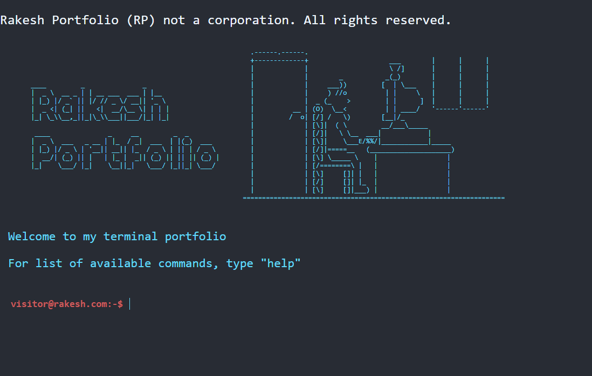

<h1 align="center" id="title">Portfolio - Terminal</h1>

<p align="center"></p>

<p id="description">Portfolio website on a terminal based theme. There is in depth DOM manipulation with the help of js.</p>

<p> If you are viewing it in a mobile phone then you have to switch to desktop mode.</p>

<p> Thank You </p>

<h2>🚀 Demo</h2>

[https://portfolio-terminal-two.vercel.app/](https://portfolio-terminal-two.vercel.app/)

<h2>🛠️ Installation Steps:</h2>

<p>1. clone the repository</p>

```
git clone https://github.com/rakesh1623/Portfolio-Terminal.git
```

<p>2. change directory</p>

```
Portfolio-Terminal
```

<p>3. You are good to go !</p>

  
  
<h2>💻 Built with</h2>

Technologies used in the project:

*   HTML
*   CSS
*   JS